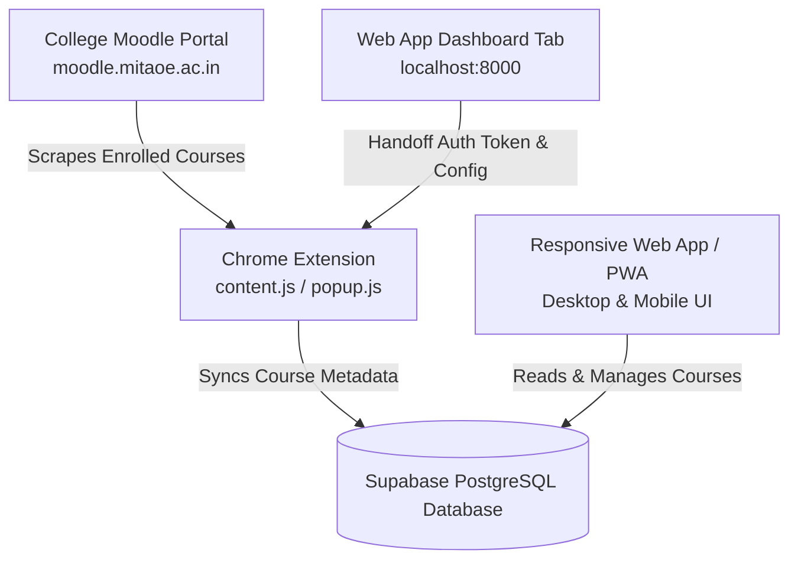

# Moodle Course Hub

Moodle Course Hub is a production-quality, cross-device web application and desktop helper system that enables college students to organize their Moodle courses by semester. The application works seamlessly on desktop, mobile, and as an installable Progressive Web App (PWA). A companion Chrome Extension bridges course enrollments directly from the college Moodle portal to the cloud database.

---

## 1. Project Architecture

The system consists of four primary components:



1.  **Responsive Web App (Dashboard & Settings):** Built with pure HTML5, CSS3, and ES6 JavaScript. Connects directly to Supabase.
2.  **Chrome Extension (Sync Bridge):** Sandboxed Manifest V3 browser utility running only on the Moodle domain. Detects course links and synchronizes them with Supabase.
3.  **Supabase PostgreSQL Cloud Database:** Central database storing user configurations, semesters list, course details, and synchronization logs.
4.  **PWA Core:** Service worker and Web Manifest allowing offline loading, app shell caching, and installation on mobile home screens.

---

## 2. Supabase Cloud Database Setup

Log into your Supabase Console, navigate to the **SQL Editor**, and run the migrations:

### Step 1: Run Schema Definition (`supabase/schema.sql`)
This creates the core directory structure, unique index constraints, and update triggers:
```sql
-- 1. Create Semesters Table
CREATE TABLE IF NOT EXISTS semesters (
    id UUID PRIMARY KEY DEFAULT gen_random_uuid(),
    user_id UUID NOT NULL REFERENCES auth.users(id) ON DELETE CASCADE,
    name TEXT NOT NULL,
    semester_number INTEGER NOT NULL,
    is_current BOOLEAN DEFAULT false,
    is_archived BOOLEAN NOT NULL DEFAULT false,
    created_at TIMESTAMPTZ DEFAULT timezone('utc'::text, now())
);

-- Ensure only one semester is set as current per user
CREATE UNIQUE INDEX IF NOT EXISTS unique_current_semester ON semesters (user_id) WHERE (is_current = true);

-- 2. Create Courses Table
CREATE TABLE IF NOT EXISTS courses (
    id UUID PRIMARY KEY DEFAULT gen_random_uuid(),
    user_id UUID NOT NULL REFERENCES auth.users(id) ON DELETE CASCADE,
    moodle_course_id TEXT NOT NULL,
    semester_id UUID REFERENCES semesters(id) ON DELETE CASCADE,
    name TEXT NOT NULL,
    display_name TEXT NOT NULL,
    url TEXT NOT NULL,
    position INTEGER NOT NULL DEFAULT 0,
    is_hidden BOOLEAN NOT NULL DEFAULT false,
    is_moodle_active BOOLEAN NOT NULL DEFAULT true,
    created_at TIMESTAMPTZ DEFAULT timezone('utc'::text, now()),
    updated_at TIMESTAMPTZ DEFAULT timezone('utc'::text, now())
);

-- Prevent duplicate moodle course IDs for the same user
CREATE UNIQUE INDEX IF NOT EXISTS unique_user_moodle_course ON courses (user_id, moodle_course_id);

-- 3. Create Settings Table
CREATE TABLE IF NOT EXISTS settings (
    user_id UUID PRIMARY KEY REFERENCES auth.users(id) ON DELETE CASCADE,
    current_semester_id UUID REFERENCES semesters(id) ON DELETE SET NULL,
    pokemon_enabled BOOLEAN NOT NULL DEFAULT false,
    auto_assign_new_courses BOOLEAN NOT NULL DEFAULT true,
    theme TEXT NOT NULL DEFAULT 'light',
    last_sync_at TIMESTAMPTZ DEFAULT null,
    last_sync_status TEXT NOT NULL DEFAULT 'none',
    last_sync_message TEXT DEFAULT null,
    created_at TIMESTAMPTZ DEFAULT timezone('utc'::text, now()),
    updated_at TIMESTAMPTZ DEFAULT timezone('utc'::text, now())
);

-- Triggers to auto-update updated_at columns
CREATE OR REPLACE FUNCTION update_updated_at_column()
RETURNS TRIGGER AS $$
BEGIN
    NEW.updated_at = timezone('utc'::text, now());
    RETURN NEW;
END;
$$ language 'plpgsql';

CREATE OR REPLACE TRIGGER update_courses_updated_at BEFORE UPDATE ON courses FOR EACH ROW EXECUTE FUNCTION update_updated_at_column();
CREATE OR REPLACE TRIGGER update_settings_updated_at BEFORE UPDATE ON settings FOR EACH ROW EXECUTE FUNCTION update_updated_at_column();
```

### Step 2: Run RLS Policies (`supabase/policies.sql`)
Enable Row-Level Security on all tables so authenticated users can read/write only their own records:
```sql
ALTER TABLE semesters ENABLE ROW LEVEL SECURITY;
ALTER TABLE courses ENABLE ROW LEVEL SECURITY;
ALTER TABLE settings ENABLE ROW LEVEL SECURITY;

-- Apply Select/Insert/Update/Delete policies for 'semesters', 'courses', and 'settings'
-- checking (auth.uid() = user_id) on all operations.
```

---

## 3. Local Development Setup

1.  Open your project directory: `c:\Users\ashis\OneDrive\Desktop\Projects\moodle`.
2.  Open [`web/js/config.js`](file:///c:/Users/ashis/OneDrive/Desktop/Projects/moodle/web/js/config.js) and fill in your Supabase connection strings (URL & Anon Public Key).
3.  Start a local HTTP Web Server inside the `web` folder:
    ```powershell
    npx http-server ./web -p 8000
    ```
4.  Navigate to `http://localhost:8000` in your web browser.
5.  Click **Sign Up** to create an account, then log in. The application will automatically initialize default settings and semesters (`SEM 4` through `SEM 8`) in the backend.

---

## 4. Extension Installation (Desktop)

1.  Open Chrome and navigate to `chrome://extensions/`.
2.  In the top right, toggle **Developer mode** to ON.
3.  Click **Load unpacked** in the top left.
4.  Select the `extension/` directory within the workspace: `c:\Users\ashis\OneDrive\Desktop\Projects\moodle\extension`.
5.  With the web app open at `http://localhost:8000/dashboard.html`, click the Extension puzzle icon in your browser toolbar, pin **Moodle Course Hub Sync**, and open it.
6.  The extension will capture the session from your open browser tab and connect automatically.

---

## 5. PWA Installation (Mobile & Desktop)

-   **Desktop:** While viewing `http://localhost:8000/dashboard.html` in Chrome, click the PWA install icon on the right side of the address bar, or click **Install** in the custom dashboard prompt banner.
-   **Mobile Android/iOS:** Open the URL using Chrome on Android, tap the custom installation banner, or tap Chrome's three-dot menu and select **Add to Home screen**. The application will cache locally using `sw.js` and can run offline.

---

## 6. Moodle Configuration and Detection

-   **Scraper Host Permission:** The extension requests permission only for `http://moodle.mitaoe.ac.in/*`, protecting user privacy.
-   **Scraping Viewports:** The content script runs on page load and dynamically binds a `MutationObserver` on Moodle overview dashboards (`/my/`).
-   **Scraper selectors:** It targets `[data-region="course-card"]`, extracting names from `.coursename .multiline` to block progress text, with a global fallback matching all `a[href*="/course/view.php?id="]` elements.

---

## 7. Troubleshooting

-   **Sync status says "Disconnected":** Ensure that you have the Web App dashboard open in a browser tab at `http://localhost:8000/dashboard.html` and are logged in. The extension requires the active dashboard tab to clone the JWT access session.
-   **Extension shows 0 courses detected:** Make sure Moodle dashboard page (`http://moodle.mitaoe.ac.in/my/`) is currently open in your browser. Navigating to single course pages or settings will not trigger scraping.
-   **Network Error / Supabase offline:** If Supabase drops connection, the dashboard falls back to cached offline shell, and the extension halts the sync gracefully without corrupting local data.

---

## 8. Security Notes

-   **No service-role keys:** The application utilizes public Anon Keys combined with PostgreSQL Row Level Security (RLS) to restrict course manipulation.
-   **Safe Storage:** No passwords, tokens, or credentials are saved in git commits or unencrypted extension configurations.
-   **Strict Origins:** Handoff script is locked to read credentials only from verified localhost/dashboard tabs.

---

## 9. Production Deployment Guide

To deploy the Moodle Course Hub for production (without Python server dependencies):

### A. Web Application Static Deployment (Vercel)
1.  Sign in to [Vercel](https://vercel.com) and click **Add New Project**.
2.  Import this repository.
3.  In the Project Settings, under **Root Directory**, set it to **`web`** (this ensures Vercel serves the dashboard assets and utilizes the pre-configured `vercel.json` clean URL routing).
4.  Deploy! Vercel will generate a secure HTTPS production domain (e.g., `https://moodle-course-hub.vercel.app`).

### B. Supabase Configuration (Redirect URLs)
1.  Navigate to your [Supabase Dashboard](https://supabase.com/dashboard) and go to **Authentication** -> **URL Configuration**.
2.  Set the **Site URL** to:
    ```text
    https://<your-vercel-domain>.vercel.app/
    ```
3.  Add the following patterns to **Redirect URLs**:
    ```text
    https://<your-vercel-domain>.vercel.app/**
    http://localhost:8000/** (optional, to keep local testing active)
    ```
4.  Save changes.

### C. Extension Reconnection
1.  Open the deployed Vercel dashboard in your browser and log in to your account.
2.  Navigate to the **Settings** page and click **Connect Extension** (or **Reconnect**).
3.  The extension secure connection bridge will automatically detect the Vercel HTTPS domain and bind it as your primary dashboard sync coordinate.
4.  When you open your Moodle Portal (`http://moodle.mitaoe.ac.in/my/`) and click the extension popup, it will dynamically direct you back to your production Vercel app domain!

